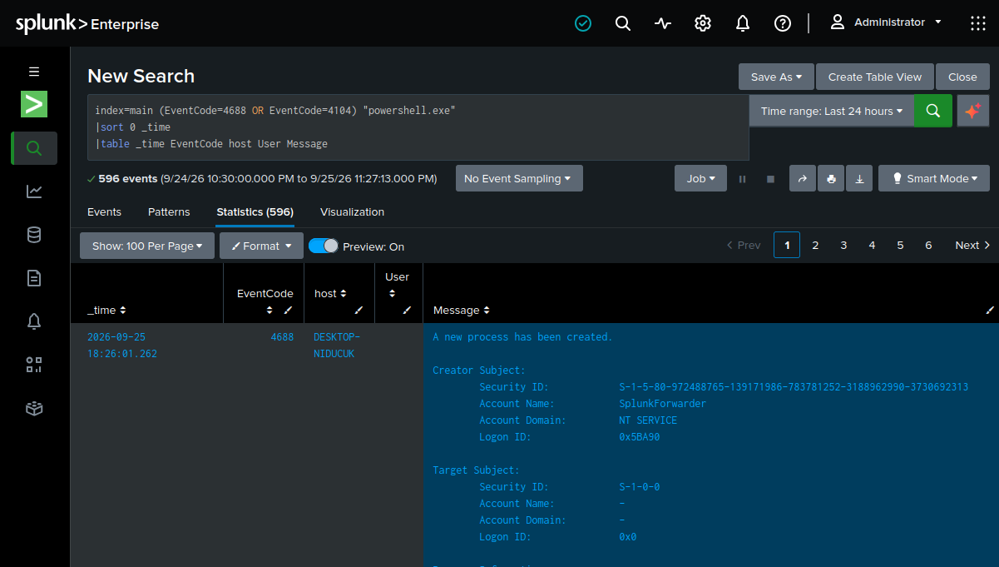
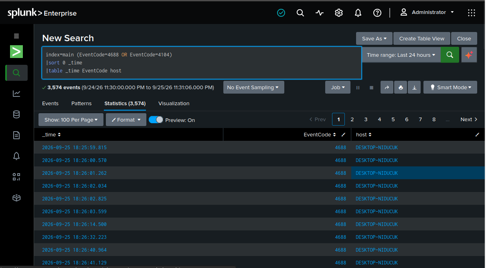
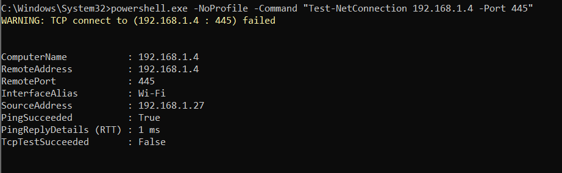
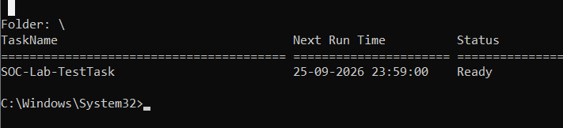
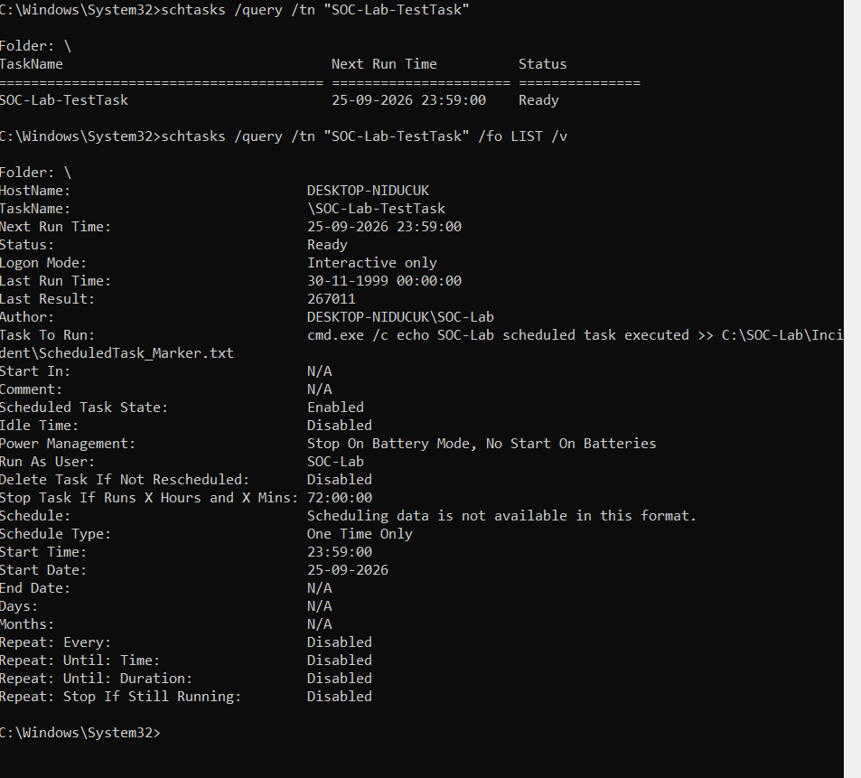
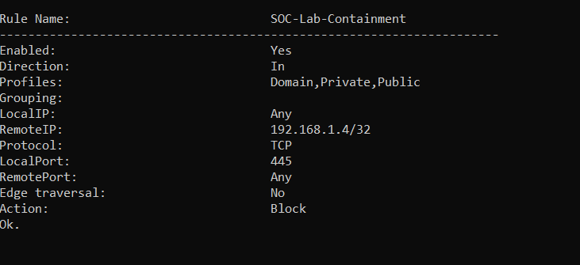
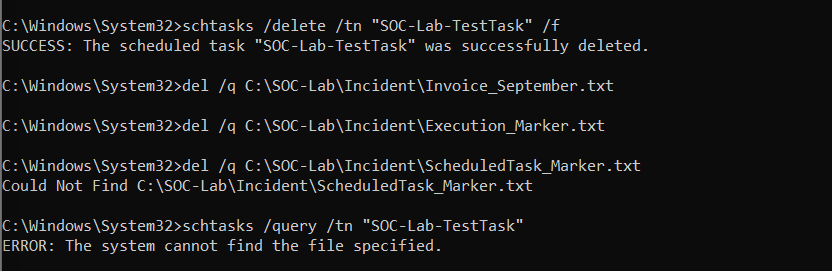
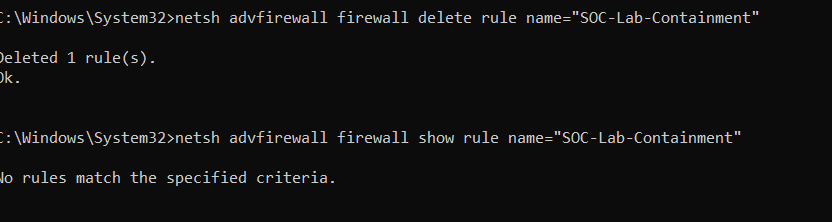
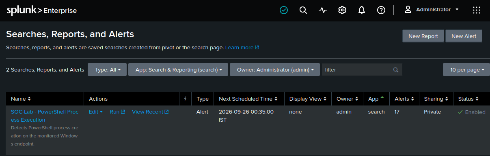

# Windows Attack Chain Detection & Incident Response

## Overview

This project demonstrates a complete, controlled SOC investigation and incident response workflow using a Windows endpoint, Kali Linux, and Splunk Enterprise.

The objective was to simulate a realistic Windows attack chain using **harmless lab activities**, generate security telemetry, forward the telemetry to Splunk, detect suspicious behavior, trigger a scheduled SOC alert, investigate the activity, and perform containment, eradication, and recovery.

No real malware, ransomware, virus, or malicious payload was used.

### Investigation Workflow

```text
SOC Lab Setup
      ↓
Controlled Attack Simulation
      ↓
Windows Security Telemetry
      ↓
Splunk Universal Forwarder
      ↓
Splunk Enterprise
      ↓
Detection Engineering
      ↓
Scheduled Alert
      ↓
Investigation & Timeline
      ↓
Containment
      ↓
Eradication
      ↓
Recovery
      ↓
Lessons Learned
```

---

# Objectives

* Build a practical Windows SOC monitoring environment
* Collect Windows security telemetry in Splunk
* Monitor PowerShell process execution
* Analyze Windows Event IDs
* Simulate suspicious endpoint behavior safely
* Create a Splunk detection
* Configure and test scheduled alerting
* Investigate a simulated attack chain
* Construct an incident timeline
* Perform containment
* Perform eradication
* Perform recovery
* Document the investigation using evidence

---

# Lab Architecture

| Component        | Role                           | IP Address     |
| ---------------- | ------------------------------ | -------------- |
| Windows Endpoint | Monitored SOC endpoint         | `192.168.1.27` |
| Kali Linux       | Controlled attack/test machine | `192.168.1.4`  |
| Ubuntu           | Splunk Enterprise server       | `192.168.1.5`  |

### Main Components

* Windows 10/11 endpoint
* Splunk Enterprise
* Splunk Universal Forwarder
* Kali Linux
* Windows Event Viewer
* Windows Firewall
* PowerShell
* Windows Task Scheduler
* Nmap
* SMB testing tools

---

# 1. Windows Telemetry Collection

The Windows endpoint was configured to forward security telemetry to Splunk through the Splunk Universal Forwarder.

The following Windows log sources were configured:

* Windows Security
* PowerShell Operational
* Windows Defender Operational
* Task Scheduler Operational
* Windows Firewall
* DNS Client

Additional auditing was enabled for:

* Process Creation
* PowerShell Script Block Logging

### Important Event IDs

| Event ID | Purpose                         |
| -------- | ------------------------------- |
| 4624     | Successful logon                |
| 4625     | Failed logon                    |
| 4688     | Process creation                |
| 4104     | PowerShell Script Block Logging |

The telemetry was successfully received by Splunk and verified through searches.

---

# 2. Initial Reconnaissance

A controlled Nmap scan was performed from the Kali test machine against the Windows lab endpoint.

```bash
nmap -Pn -sV 192.168.1.27
```

The scan was used to identify exposed Windows services and understand the attack surface before the controlled simulation.

SMB port 445 was separately verified during the earlier investigation.

```bash
nmap -Pn -p 445 -sV 192.168.1.27
```

---

# 3. Controlled Authentication Investigation

A controlled authentication scenario was performed using the dedicated `SOC-Lab` Windows account.

The investigation generated:

* Failed authentication events
* A subsequent successful authentication
* Source IP information
* Logon type information
* Authentication package information
* Status/substatus information

The relevant Windows events were investigated in Splunk using:

```spl
index=main EventCode=4625 "SOC-Lab"
```

and:

```spl
index=main EventCode=4624 "SOC-Lab"
```

The investigation demonstrated how a SOC analyst can distinguish repeated authentication failures from a later successful authentication and build a chronological understanding of the activity.

The `SOC-Lab` account was verified as a standard user rather than an administrator.

---

# 4. PowerShell Telemetry

PowerShell Script Block Logging was enabled on the Windows endpoint.

A harmless PowerShell command was executed to generate security telemetry.

Example:

```cmd
powershell.exe -NoProfile -Command "Write-Output 'SOC-Lab fresh alert test'"
```

The resulting PowerShell activity was successfully observed through Windows telemetry and forwarded to Splunk.

### Process Creation Detection

Windows Event ID **4688** was used to identify PowerShell process creation.

Example Splunk search:

```spl
index=main EventCode=4688 "powershell.exe"
```

### PowerShell Script Block Logging

Windows Event ID **4104** was also verified in Splunk.

Example:

```spl
index=main EventCode=4104
```

This provided visibility into PowerShell activity beyond simply detecting that the executable had started.

---

# 5. Harmless Suspicious-Document Simulation

A controlled lab workspace was created:

```text
C:\SOC-Lab
├── Incident
├── Evidence
└── Quarantine
```

A harmless text file was created to represent a simulated document:

```text
Invoice_September.txt
```

A harmless PowerShell command was then used to simulate suspicious document execution behavior.

The command created a marker file and generated PowerShell telemetry.

No malicious payload was used.

The purpose was to reproduce the type of endpoint behavior that a SOC analyst might investigate after receiving a suspicious process alert.

---

# 6. Detection Engineering

A Splunk detection was created to identify PowerShell process execution.

### Detection Search

```spl
index=main EventCode=4688 "powershell.exe"
```

The search was verified against the Windows telemetry and successfully returned PowerShell process-creation events.

A basic aggregation was also tested:

```spl
index=main EventCode=4688 "powershell.exe"
| stats count by host
```

This demonstrated how detection results can be summarized by endpoint.

---

# 7. Scheduled Splunk Alert

The PowerShell detection was configured as a scheduled Splunk alert.

### Alert

**SOC-Lab - PowerShell Process Execution**

### Configuration

* Type: Alert
* Schedule: Enabled
* Trigger condition: Results greater than 0
* Time range: Last 15 minutes
* Trigger behavior: Once
* Owner: `admin`
* App: `Search`
* Sharing: Private
* Status: Enabled

The alert was tested using fresh PowerShell process-creation telemetry.

The alert successfully triggered and the Splunk interface showed:

**17 triggered alerts**

This confirms that the detection search was not only returning events but was also being evaluated by the scheduled alert mechanism.

---

# 8. Network Activity Simulation

A controlled TCP connection test was performed from the Windows endpoint toward the Kali test machine.

```powershell
Test-NetConnection 192.168.1.4 -Port 445
```

The test demonstrated how a SOC analyst can investigate endpoint-to-endpoint network communication and distinguish successful connectivity from a blocked or failed connection.

The test returned:

```text
PingSucceeded    : True
TcpTestSucceeded : False
```

This demonstrated that ICMP connectivity existed while the TCP/445 connection was unsuccessful.

---

# 9. Persistence Simulation

A harmless Windows Scheduled Task was created to simulate persistence behavior.

Task name:

```text
SOC-Lab-TestTask
```

The task was configured to execute a harmless command that would write a marker file.

The task was then investigated using:

```cmd
schtasks /query /tn "SOC-Lab-TestTask" /fo LIST /v
```

This demonstrated how a SOC analyst can investigate scheduled tasks as a potential persistence mechanism.

The task was intentionally harmless and created only for the controlled lab.

---

# 10. Event Timeline Investigation

PowerShell process and script-block telemetry were combined into a chronological investigation.

Example search:

```spl
index=main (EventCode=4688 OR EventCode=4104)
| sort 0 _time
| table _time EventCode host
```

This allowed the investigation to establish the sequence of endpoint activity and understand how multiple Windows events can contribute to a single incident timeline.

---

# 11. Incident Findings

The controlled investigation demonstrated the following SOC-relevant behaviors:

1. Windows endpoint reconnaissance was performed.
2. SMB exposure was investigated.
3. Authentication activity was generated and analyzed.
4. Failed authentication events were observed.
5. Successful authentication was observed.
6. PowerShell execution generated Event ID 4688.
7. PowerShell Script Block Logging generated Event ID 4104.
8. Suspicious-document execution was safely simulated.
9. Network connectivity was tested.
10. A scheduled task was created to simulate persistence.
11. Splunk detection identified PowerShell process execution.
12. A scheduled Splunk alert successfully triggered.
13. The activity was investigated using Windows and Splunk telemetry.
14. Containment was performed.
15. Simulated persistence and artifacts were removed.
16. The endpoint was returned to a clean lab state.

---

# 12. Containment

After identifying the simulated activity, a temporary Windows Firewall containment rule was created to block SMB communication from the controlled Kali test machine.

```cmd
netsh advfirewall firewall add rule name="SOC-Lab-Containment" dir=in action=block protocol=TCP localport=445 remoteip=192.168.1.4
```

The rule was then verified through Windows Firewall configuration.

This represented the **containment** stage of the incident response lifecycle.

The objective was to restrict the simulated attacker's access while the investigation and remediation were performed.

---

# 13. Eradication

The simulated persistence mechanism and harmless test artifacts were removed.

The Scheduled Task was deleted:

```cmd
schtasks /delete /tn "SOC-Lab-TestTask" /f
```

The harmless test artifacts were also removed.

The task was then queried again to verify that it no longer existed.

This represented the **eradication** stage.

---

# 14. Recovery

After remediation, the temporary containment firewall rule was removed:

```cmd
netsh advfirewall firewall delete rule name="SOC-Lab-Containment"
```

The environment was then verified.

Final verification confirmed:

* The containment firewall rule no longer existed.
* The simulated Scheduled Task no longer existed.
* The simulated test artifacts had been removed.
* The incident directory contained only the project README artifact.

This represented the **recovery** stage of the incident response lifecycle.

---

# 15. Incident Response Lifecycle Demonstrated

| Phase           | Lab Activity                                      |
| --------------- | ------------------------------------------------- |
| Preparation     | Built Windows + Kali + Splunk SOC lab             |
| Detection       | Splunk identified PowerShell process creation     |
| Alerting        | Scheduled Splunk alert triggered                  |
| Investigation   | Analyzed Windows Event IDs and endpoint activity  |
| Timeline        | Correlated PowerShell events chronologically      |
| Containment     | Blocked SMB access using Windows Firewall         |
| Eradication     | Removed scheduled task and simulated artifacts    |
| Recovery        | Removed containment rule and verified clean state |
| Lessons Learned | Documented detection and response improvements    |

---

# 16. Evidence

### Evidence 08 — PowerShell Detection Results



Demonstrates the Splunk detection search identifying PowerShell process-creation activity.

---

### Evidence 09 — PowerShell Event Timeline



Demonstrates chronological investigation of Windows PowerShell-related events.

---

### Evidence 10 — Network Connection Test



Demonstrates controlled endpoint network connectivity testing.

---

### Evidence 12 — Scheduled Task Creation



Demonstrates creation of the harmless scheduled task used to simulate persistence.

---

### Evidence 13 — Scheduled Task Investigation



Demonstrates investigation of the scheduled task using Windows command-line tools.

---

### Evidence 14 — Containment Firewall Block



Demonstrates the temporary firewall containment action.

---

### Evidence 16 — Eradication



Demonstrates removal of the simulated scheduled task and test artifacts.

---

### Evidence 17 — Recovery



Demonstrates removal of the temporary containment rule and restoration of the lab environment.

---

### Evidence 18 — Splunk Scheduled Alert Triggered



Demonstrates the configured Splunk alert in an enabled state and shows that the alert successfully triggered.

The alert displayed **17 triggered alerts** during testing.

---

# 17. Skills Demonstrated

### SOC / SIEM

* Splunk Enterprise
* Splunk Universal Forwarder
* SIEM architecture
* Log collection
* Log analysis
* Detection engineering
* Scheduled alerting
* Event correlation
* Incident investigation
* Timeline analysis

### Windows Security

* Windows Event Viewer
* Event ID 4624
* Event ID 4625
* Event ID 4688
* Event ID 4104
* PowerShell monitoring
* Process creation auditing
* Script Block Logging
* Windows Firewall
* Scheduled Task investigation
* User/group investigation

### Networking

* Nmap
* SMB
* TCP/445
* Network connectivity testing
* Source/destination analysis
* Network reconnaissance

### Incident Response

* Detection
* Investigation
* Containment
* Eradication
* Recovery
* Lessons learned
* Evidence collection
* Incident documentation

### Security Tools

* Splunk
* Nmap
* Wireshark
* Kali Linux
* Windows command-line tools

---

# 18. Lessons Learned

This project reinforced several practical SOC concepts:

* A single event rarely provides the complete incident story.
* Authentication events should be investigated with source information, timestamps, logon type, and context.
* Process creation telemetry can provide important endpoint visibility.
* PowerShell Script Block Logging provides additional investigation context.
* Scheduled Tasks can be investigated as potential persistence mechanisms.
* Network activity can help connect endpoint behavior with other systems.
* Detection searches need to be tested against fresh telemetry.
* Scheduled alerts must be verified through actual triggering rather than assuming configuration alone is sufficient.
* Incident response requires more than detection; containment, eradication, and recovery must also be considered.
* Lab simulations can safely reproduce SOC-relevant behaviors without deploying real malware.

---

# Conclusion

This project demonstrates a complete hands-on Windows SOC investigation using a controlled attack simulation and Splunk-based detection workflow.

The lab progressed from endpoint telemetry collection and attack simulation through detection, scheduled alerting, investigation, timeline analysis, containment, eradication, and recovery.

The project provides practical evidence of experience with:

**Windows Security + PowerShell + Splunk + SIEM Detection + Endpoint Investigation + Network Investigation + Incident Response**

All activities were performed in a controlled laboratory environment using harmless simulations.
